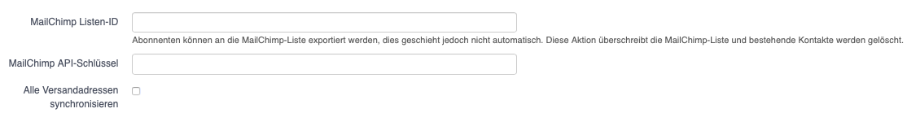
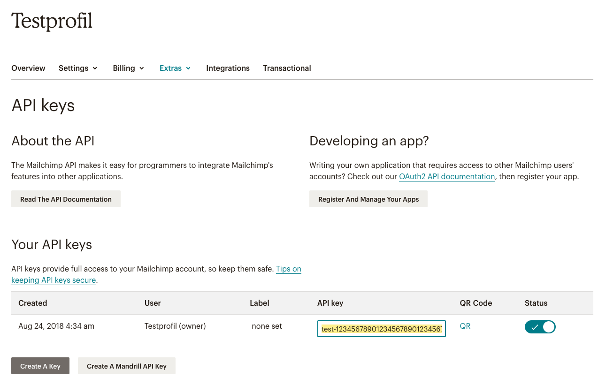

# Annexe 2: MailChimp

L’exportation MailChimp permet d’exporter les destinataires des listes de publipostage vers une liste MailChimp.

La liste MailChimp est **écrasée** par l’exportation, c’est-à-dire que les destinataires qui, dans hitobito, n’appartiennent plus à la liste à exporter (p. ex. parce qu’ils n’ont plus le rôle correspondant) seront supprimés dans MailChimp lors de la prochaine exportation.

La liste MailChimp est exportée automatiquement **toutes les 24 heures** et, si nécessaire, également **manuellement** par pression sur un bouton.

La fonction MailChimp permet d’utiliser les données gérées dans hitobito pour envoyer des newsletters conçues avec MailChimp.

## Lier une liste de publipostage à MailChimp

Une audience MailChimp peut être associée à chaque liste de publipostage. Cette opération se fait dans les paramètres de la liste de publipostage, via les deux champs «Clé API MailChimp» et «ID listes MailChimp»:

Par défaut, seules les adresses e-mail principales des abonné(e)s sont synchronisées. Si d’autres adresses e-mail ayant l’option «Envoi» doivent également être synchronisées avec MailChimp, il faut sélectionner l’option «Synchroniser toutes les adresses d’envoi».

Vous pouvez obtenir les «ID listes MailChimp» dans les paramètres de l’audience souhaitée dans MailChimp (en jaune en haut à droite):

La «Clé API MailChimp» permet à une application tierce comme hitobito d’effectuer des modifications en votre nom dans MailChimp. Vous pouvez créer une nouvelle clé API dans le menu «Outils / Clés API» dans les paramètres de votre profil. Sur la page correspondante, vous pouvez cliquer sur «Create A Key» (en bas à gauche sur l’image) et copier la clé API («API key») du champ textuel (surlignage en jaune dans l’image) dans le champ correspondant dans hitobito:

> 

Félicitations, après avoir enregistré ces deux informations, votre liste de publipostage est maintenant liée à la liste MailChimp!

## Exporter vers MailChimp

Pour exporter les destinataires d’une liste de publipostage vers MailChimp, sélectionnez l’option correspondante sous «Exportation» dans la vue «Abonnés» de votre liste de publipostage dans hitobito:

La commande d’exportation ’Mailchimp’ n’est visible que si la liste de publipostage a été préalablement liée à une audience MailChimp.

Une fois l’exportation déclenchée, la liste est exportée en arrière-plan vers l’audience MailChimp choisie et les destinataires de votre liste de publipostage devraient y apparaître peu de temps après.

Les destinataires de votre liste de publipostage qui se sont activement désinscrits de votre liste MailChimp par le passé (via le lien de désinscription dans votre e-mail) conservent leur statut «Unsubscribed» et ne recevront plus d’e-mails de votre part, même après une nouvelle exportation depuis hitobito.

