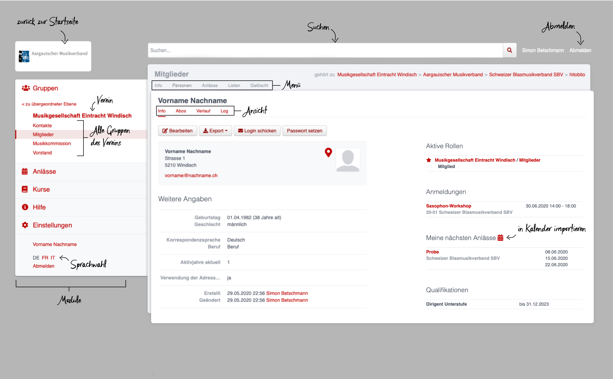
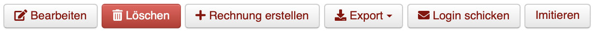
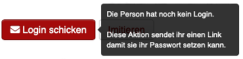
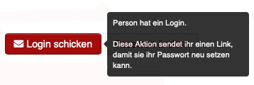
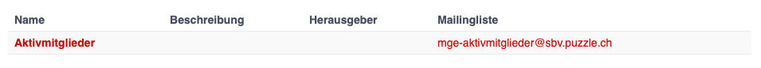
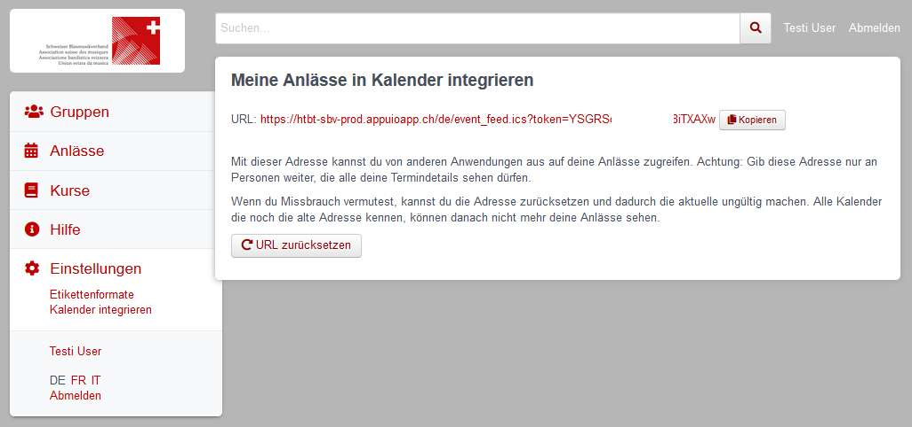
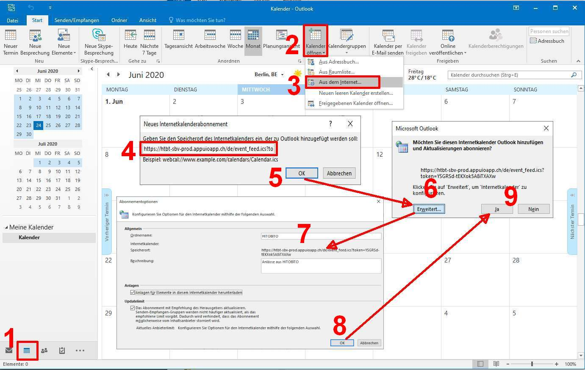
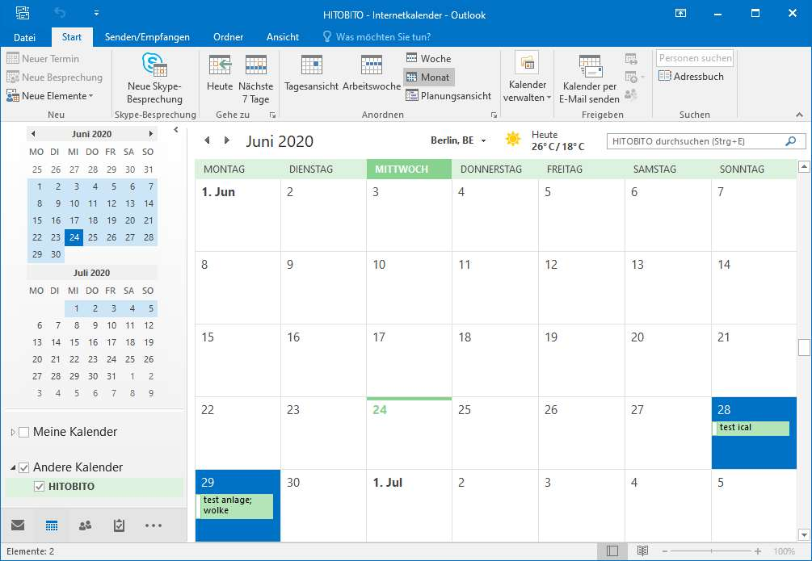

# Utilisateur domestique

## Vue d’ensemble

- Modules Vous pouvez choisir le module souhaité dans la sélection des modules: Groupes | Evénements | Cours | Factures | Aide | Paramètres.

- Menu   Dans le module Groupes, chaque groupe dispose de différents points de menu affichés selon les autorisations (p. ex. Info, Personnes, Evénements, Listes, Supprimé, etc.)

- Les personnes disposent en outre des vues suivantes: Info | Abonnements | Historique | Log.

- Commandes  En fonction des groupes et des rôles qui vous sont attribués, vous disposez de diverses commandes dans les différents modules et vues.

- Recherche  Le champ de recherche permet de rechercher des personnes, des sociétés, des associations, des événements, des cours, etc.

- Choix de la langue  Il est possible de commuter entre l’allemand le français et l’italien.

- Déconnexion  Le lien de déconnexion permet à l’utilisateur de se déconnecter de hitobito.

Logo Un clic sur le logo de la société ou de l’association conduit à la page d’accueil de l’utilisateur, c’est-à-dire à celle du du groupe principal.

- Rôles actifs  Vue d’ensemble de tous les rôles actifs de l’utilisateur. Si un utilisateur est membre de plusieurs sociétés ou associations, une étoile pleine indique ce que l’on appelle le groupe principal. Pour changer de groupe principal, cliquez sur une étoile non remplie à côté d’une société ou d’une association.

## Recherche

Les premiers résultats s’affichent dans un menu déroulant sous le champ de recherche en direct, c’est-à-dire qu’ils s’adaptent en fonction de chaque lettre supplémentaire. Un clic sur l’icône «loupe» à droite du champ de recherche fait apparaître le résultat complet de la recherche. Seuls les résultats auxquels l’utilisateur a accès sont trouvés.

## Vue Info

La vue Info vous permet de voir, si vous en avez l’autorisation

- les coordonnées d’une personne ainsi que d’autres informations telles que le nombre d’années d’activité calculé par le système sur la base des rôles saisis. Les rôles actifs sont également affichés, le groupe principal étant indiqué par une étoile rouge pleine.

Les commandes suivantes sont à votre disposition sur votre propre page et sur celles d’autres personnes, pour autant que vous disposiez des autorisations nécessaires:

- Traiter  Modifier les coordonnées

- Effacer   Effacer la personne

- Etablir une facture  Etablir une facture pour cette personne

- Exporter  Télécharger les données affichées dans différents formats (CSV, PDF, Excel, etc.).

- Envoyer le Login   Cette commande envoie un e-mail à l’utilisateur avec un lien pour définir un mot de passe. En passant sur ce bouton avec la souris, on voit si l’utilisateur a déjà un login ou non.

- Imiter  Cette fonction permet de reprendre les droits d’une personne, c’est-à-dire d’obtenir une vue d’hitobito sous la perspective de la personne en question.

- Modifier le mot de passe  Modifiez votre mot de passe de connexion à hitobito. Vous ne pouvez modifier que votre propre mot de passe.

Sur la droite se trouve une vue d’ensemble de tous les rôles actuels de la personne, des tags qui lui sont attribués, de ses inscriptions aux événements et cours à venir ainsi que des qualifications qu’elle a acquises.

La fonction  `intégrer dans l'agenda` permet à chaque utilisateur de générer une URL à laquelle il peut s’abonner dans son application agenda. Cette fonction n’est actuellement disponible que pour les événements.

## Vue Abonnements

Liste des listes de publipostage auxquelles l’utilisateur est inscrit.

## Vue Historique

La vue «Historique» offre une vue d’ensemble de tous les `Groupes → Rôles` dont la personne dispose actuellement et a eu par le passé. S’agissant des rôles passés, des dates de début et de fin sont indiquées; pour les rôles actuels, seule une date de début est indiquée.

Les événements auxquels la personne est ou était inscrite sont également indiqués ici dans une liste.

![Abbildung Startseite Benutzer → Verlauf [Ansicht Rechnungen
hinzufügen]](media/image10.png)

## Vue Log

La vue «Log» vous permet de suivre qui a modifié quelles informations vous concernant et quand.

## Vue Factures

La vue «Factures» indique toutes les factures qui ont été envoyées à la personne.

Les droits de disposer de la vue Factures ne sont pas encore clairement définis → à clarifier avec hitobito

# Module Groupes

## Menu Info

Le point de menu «Info» permet de sélectionner une personne de contact pour chaque groupe ou de définir une «adresse de la société». Suivant le type de groupe, d’autres informations sont également disponibles (description, langue de correspondance, année de fondation, etc.)

L’adresse définie dans le menu «Info» (adresse de la société explicitement indiquée ou sélection d’une personne de contact) est par exemple utilisée comme expéditeur pour les e-mails.

## Menu Personnes

Le menu «Personnes» affiche par défaut – dans le cas de sa propre société – tous les membres du groupe remplissant une fonction précise. Ce point de menu n’est pas visible pour les sociétés tierces.

Un clic sur le bouton `Colonnes` permet de définir quelles données doivent être affichées dans l’aperçu. Les commandes `Exporter` et `Imprimer` permettent de télécharger ou d’imprimer les données affichées.

**Exemple**: si votre propre société est sélectionnée, les fonctions particulières d’administrateur, de responsable SUISA et de directeur sont affichées:

La fonction `Autres vues` permet d’afficher toutes les personnes («Niveau complet») ou de définir un filtre.

**Exemple**: si le groupe `Membres` de la propre société est sélectionné, toutes les personnes de ce groupe sont affichées, à savoir la liste de tous les membres actifs.

Le groupe `Comité` fait apparaître toutes les personnes de ce groupe, à savoir la liste de tous les membres du comité.

Si une ou plusieurs personnes sont sélectionnées (coche tout à gauche de la liste), d’autres commandes apparaissent, qui permettent de traiter simultanément toutes les personnes sélectionnées:

## Menu Evénements

Le point de menu Evénements recense les événements créés par la société affichée (si le groupe «Société» est sélectionné) ou ceux créées par le sous-groupe sélectionné correspondant. Ici, les membres peuvent s’inscrire aux événements, les exporter ou les inscrire directement dans l’agenda (à l’aide d’un fichier iCalendar).

Peuvent être affichés au niveau d’une association cantonale tous les événements de sa région, et, au niveau l’Association suisse des musiques, tous les événements de l’ASM.

## Menu Fêtes des musiques

Ce point de menu n’est visible que pour les administrateurs. Les sociétés peuvent ici s’inscrire aux fêtes des musiques annoncées.

## Menu Listes

Le point de menu «Listes» affiche pour le membre toutes les listes de publipostage du groupe sélectionné, c’est-à-dire de la société ou de l’un de ses groupes. Suivant la configuration effectuée par l’administrateur, ces «adresses de transfert» peuvent également être utilisées par les membres.

## Menu Demandes

Ce point de menu n’est visible que pour les administrateurs.

## Menu Notes

Sont ici listées les notes saisies sous le point de menu Info concernant la société ou le groupe. On y voit aussi les notes des sous-groupes. Ce point de menu n’est visible que pour les administrateurs.

## Menu Supprimé

Le point de menu Supprimé indique les anciens sous-groupes de la société qui ont entre-temps été supprimés.

## Menu Clés API («API-Keys»)

Ce point de menu n’est visible que pour les administrateurs. Il est possible de générer ici des «clés API» pour la connexion technique à des sites web ou à des applications.

# Module Evénements

Sont ici affichés les événements des groupes dont l’utilisateur est membre, ainsi que leurs groupes supérieurs.

Exemples:

- Les événements de l’ASM sont affichés chez tous les membres
- Les manifestations de l’Association cantonale des musiques argoviennes (AMV) ne sont affichées que pour les membres de cette dernière
- Les événements de la société de musique Eintracht Windisch (MGE) ne sont affichés que pour les membres de cette dernière

Les autres événements figurent sous le groupe organisateur. Si un membre de l’Association cantonale des musiques zurichoises souhaite se renseigner sur les manifestations organisées en Argovie, il peut afficher les événements correspondants dans le module Groupes → Association suisse des musiques (ASM) → Association cantonale des musiques argoviennes → menu Evénements.

# Module Cours

Sont ici affichés les cours des groupes dont l’utilisateur est membre, ainsi que leurs groupes supérieurs. Les autres cours figurent sous le groupe organisateur.

# Module Aide

Le module Aide contient différentes ressources d’aide, par exemple des instructions vidéo et ce manuel d’utilisation.

# Module Paramètres

Dans le module Paramètres, le membre peut définir ses propres **formats d'étiquettes** à utiliser pour l’impression de listes (de personnes).

Sous **Intégrer le calendrier**, il est possible de générer une URL pour accéder à ses propres événements à partir d’autres applications (p. ex. Microsoft Outlook, calendrier Apple). Attention: ne donner cette adresse qu’aux personnes autorisées à voir tous les détails du rendez-vous. En cas d’abus, l’URL peut également être réinitialisée ici. Tous les calendriers qui disposent encore de l’ancienne adresse ne pourront alors plus afficher les événements.

1. Créer l'adresse
2. Copier le lien

1. Ouvrir Outlook et passer au calendrier

Sélectionner le menu **Ouvrir le calendrier** (2) via Démarrer et ouvrir une nouvelle fenêtre avec  **Depuis Internet** (3) Insérer ici, dans le champ vide, l’URL copiée depuis hitobito (4) et confirmer avec OK (5). Via Avancé (6), il est possible de saisir un nom de dossier et une description (7). Pour terminer, confirmer avec OK (8) et Oui (9).

En terminant, le nouveau calendrier avec les propres événements d’HITOBITO s’affiche dans Outlook sous Autres calendriers et est toujours actualisé:

