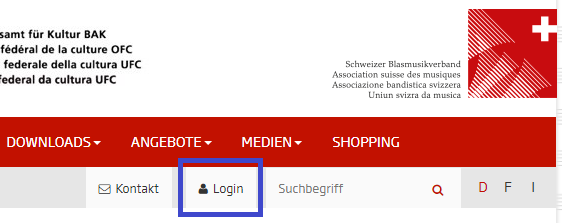
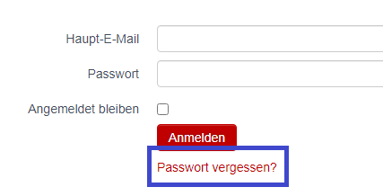

# Notions de base sur hitobito

Début 2019, l'association suisse des musiques (ASM) a présenté hitobito comme nouveau logiciel de gestion d'association. L'objectif est de réduire les efforts de maintenance des données, d'éliminer les redondances et de générer des avantages supplémentaires pour les utilisateurs et les associations affiliées.

## Qu'est-ce que Hitobito ?

hitobito offre une réelle valeur ajoutée pour les associations et les clubs, d'autant plus que les données du club ne doivent être saisies qu'une seule fois. Mais ce ne sera un réel avantage que si les données ici sont complètes et maintenues.

## Comment fonctionne Hitobito ?

En fonction de la tâche et de la fonction au sein de l'association ou du club, une personne se voit attribuer différents rôles dans hitobito. Ces rôles lui donnent également les autorisations appropriées. Selon le rôle, elle peut administrer les membres du club, enregistrer des événements, exporter des listes, émettre des factures, etc.

Les différents rôles sont divisés en différents groupes. Dans un club, il y a, entre autres, les groupes suivants :

- <verein>avec les rôles d'administrateur, de responsable SUISA, de chef d'orchestre</verein>
- Conseil d'administration avec les rôles de président, trésorier et membre
- Membres ayant les rôles de gestionnaire d'adresses, membre, membre passif et membre d'honneur
- Commission musicale avec les rôles de président et de membre

**Exemple** Une personne disposant de l'autorisation `Vorstand → Präsident` peut lire et modifier tous les détails de son club et créer des événements. Le trésorier du club avec l'autorisation `Vorstand → Kassier` peut également lire et modifier toutes les informations de son club. Cependant, il ne peut enregistrer aucun événement. Il peut créer et gérer des factures pour cela.

Les personnes disposant de l'autorisation `Mitglieder → Mitglied` ne peuvent voir et modifier que leurs propres données.

Les associations cantonales et régionales ont également d'autres groupes et rôles. Pour un aperçu complet de tous les groupes et rôles possibles, consultez l'Annexe 1 : Groupes et rôles.

## Intimité

Les données de hitobito ne peuvent être utilisées que dans le cadre des activités de la SBV et de ses associations cantonales ou de votre propre association. En principe, les données personnelles de tiers ne peuvent pas être transmises à des tiers ou à d'autres organisations. La SBV ne transmet aucune donnée à des tiers sans le consentement de la personne concernée.

Les serveurs hitobito sont situés en Suisse et sont certifiés ISO et FINMA.

Certaines des fonctionnalités décrites dans ce guide ne sont disponibles que pour les personnes disposant d'autorisations spéciales. Ils sont marqués d'un symbole de cadenas.

## Démarrer avec hitobito

Chaque membre du club peut modifier ses propres données dans hitobito avec la permission `Mitglieder → Mitglied` . Le membre a la possibilité de faire des recherches simples dans son propre club ou association et, par exemple, d'afficher, d'exporter et d'imprimer à tout moment une liste actuelle des membres actifs de son propre club. Les membres n'ont pas accès aux données d'adhésion des autres clubs.

## S'inscrire

La connexion à hitobito se trouve sur https://www.windband.ch (en haut à droite dans la barre de navigation).

Si vous vous connectez pour la première fois ou si vous avez oublié votre mot de passe, cliquez sur le lien `Passwort vergessen?` . sous le bouton de connexion.

À l'étape suivante, entrez votre adresse e-mail et cliquez sur le bouton Réinitialiser le `Passwort zurücksetzen` de passe.

L'adresse e-mail **personnelle** avec laquelle chaque membre est répertorié dans la base de données est utilisée comme nom d'utilisateur ou adresse e-mail principale.

**Important :** Les membres doivent être entrés dans hitobito avec leurs adresses e-mail personnelles. Si des adresses dites de fonction (par exemple praesident@xxx.ch) sont utilisées, ces adresses doivent être modifiées encore et encore ultérieurement si le membre change de fonction dans son association, car son successeur ne peut pas entrer la même adresse e-mail tant qu'elle est toujours utilisé par le prédécesseur.
