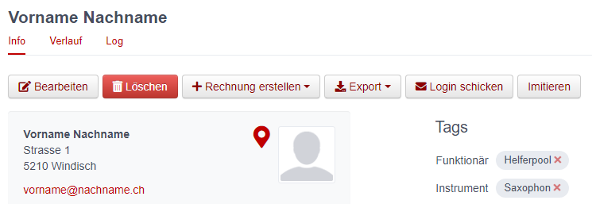

# Administration d’association 

Ce chapitre explique les fonctions spéciales permettant de gérer des associations cantonales et régionales. Elles ne sont visibles ou accessibles que pour les personnes auxquelles ont été attribués l’appartenance au groupe et le rôle correspondants.

## Module Groupes

### Supprimer des membres

Les administrateurs des associations cantonales et de l’ASM peuvent effacer des personnes. Le bouton correspondant se trouve dans le menu de la personne concernée, dans la vue «Info»:

### Cours

Les cours ne peuvent être créés que par des associations (pas par des sociétés), un rôle avec autorisation d’édition au niveau de l’association étant en l’occurrence nécessaire (p. ex. administrateur)

Indications pour la création de cours : l’option de priorité n’est disponible que si le même «type de cours» a été sélectionné pour plusieurs cours et que l’option «Définition des priorités» a été activée pour tous les cours.

## Module Factures

-tbd-

## Module SUISA

-tbd-

## Module Cours

-tbd-

## Module Evénements

Voir `Administration de société → Evénements`

## Module Aide

### Texte d'aide

Les textes peuvent être saisis dans les trois langues officielles, à savoir l’allemand, le français et l’italien. Pour traduire un texte, il faut d’abord changer la langue (en bas à gauche) et ensuite traduire le texte.

Les textes d’aide sont généraux (Stufe hitobito\!)

