# Administration de société 

Ce chapitre explique les fonctions spéciales permettant de gérer des sociétés. Elles ne sont visibles ou accessibles que pour les personnes auxquelles ont été attribués l’appartenance au groupe et le rôle correspondants.

```{admonition}
Le **nom court** ne doit pas être "MGE" pour la "Musikgesellschaft Eintracht Windisch", par exemple, car la société n’est ainsi plus identifiable. Il vaudrait mieux utiliser «MG Eintracht Windisch». En général: pour les noms courts, on n’abrège que la désignation «Musikgesellschaft», ou autre.
```

## Module Groupes

### Menu Personnes

#### Enregistrer un nouveau membre

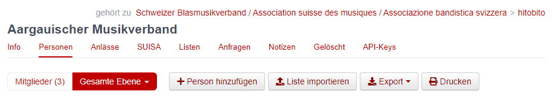

Dans le menu Personnes, le bouton **Ajouter une personne** permet d’attribuer au groupe souhaité (avec l’attribution de rôle correspondante) des membres, d’anciens membres ou même de nouvelles personnes, qui doivent d’abord être saisies.

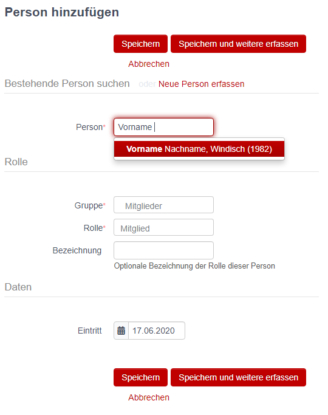

La personne doit tout d’abord être recherchée par son nom à l’aide du champ de recherche.

A l’aide du nom, une sélection pertinente des membres déjà disponibles s’affiche avec leur domicile et leur année de naissance. Si la personne recherchée existe, elle doit être attribuée

- au groupe souhaité,
- avec le rôle correspondant,
- le cas échéant, avec une autre désignation
- et la date d’entrée.

Il est ensuite recommandé de vérifier les données de la personne et de les adapter si nécessaire. Si le membre n’a pas encore d’adresse e-mail principale, celle-ci doit être utilisée pour se connecter à la base de données.

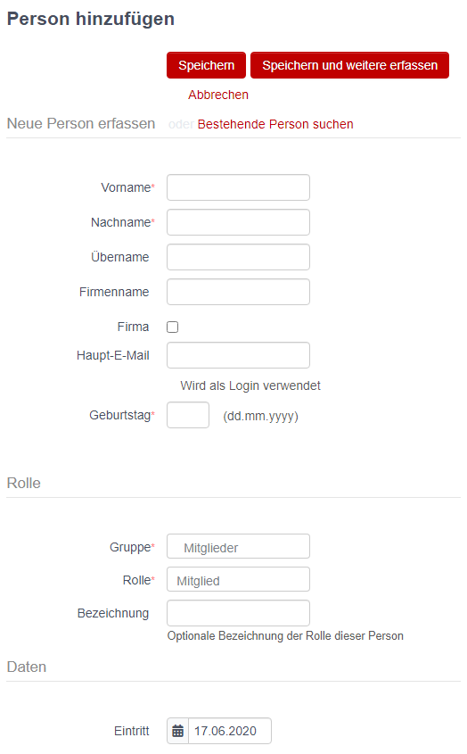

Si aucune sélection n’est affichée lors de la saisie du nom, il est possible d’appuyer directement sur **Enter** sur le clavier et d’accéder au masque pour **Saisir une nouvelle personne**.

Ici, les champs marqués d’un astérisque (prénom, nom et date de naissance) doivent au moins être complétés.

Le cas échéant, l’appartenance au groupe et le rôle doivent être adaptés.

Pour réaliser immédiatement d’autres étapes importantes, il est également recommandé de compléter immédiatement les champs **E-Mail principal** et date d'**Entrée**.

#### Importer une liste

```{admonition}
Pour que l’importation fonctionne, il faut impérativement définir la langue de correspondance de chaque utilisateur. Il s’agit de `de`, `fr`, ou `it` (attention aux majuscules et aux minuscules).
```

#### Traiter des membres

Les personnes ayant les rôles de gestionnaire d’adresses, de président ou d’administrateur peuvent traiter les données de toutes les personnes de la société ou du groupe qui leur est attribué. Pour ce faire, il faut sélectionner la personne à traiter. La vue «Info» dispose du bouton «Modifier»:

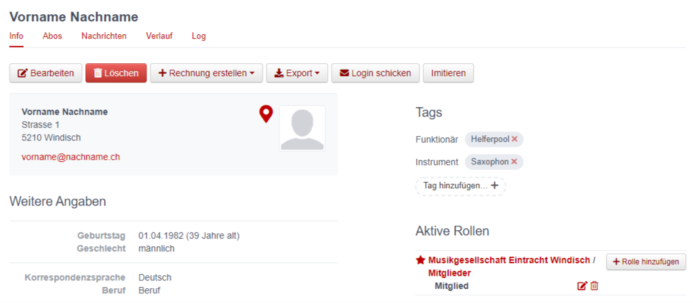

#### Traiter les rôles

Pour ajouter un nouveau rôle **actif** à un membre dans une société/association où le membre possède déjà un rôle, choisissez dans la section «Rôles actifs» **+Ajouter rôle** dans le groupe où vous souhaitez ajouter un nouveau rôle. Vous pouvez alors ajouter un rôle supplémentaire au membre au sein du groupe sélectionné et indiquer à partir de quand le rôle est valable.

Pour savoir comment ajouter à un membre un nouveau rôle  **qui n'est plus actif** dans une société/association, voir `Gérer les vétérans <Gérer vétérans T>`.

Pour retirer des rôles actifs, sélectionnez l’icône «Corbeille» dans la section «Rôles actifs» de la vue «Info». Vous mettez ainsi fin immédiatement au rôle correspondant.

#### Tags

Pour donner aux membres une certaine identification, il est possible d’utiliser ce que l’on appelle des tags, de manière structurée (p. ex. «Publipostage: newsletter», «Publipostage: imprimé», etc.) ou de manière non structurée (p. ex. «Pool d’auxiliaires», «Webmaster», etc.).

Les tags des personnes d’un groupe ne peuvent être lus et écrits que par des personnes ayant le rôle de gestionnaire d’adresses ou par des personnes disposant d’autorisations plus étendues[^1] . Les personnes ayant le rôle de membre ne peuvent pas voir leurs propres tags ni ceux des autres membres du groupe.

Les tags constituent ainsi une alternative au regroupement de personnes proches du point de vue thématique dans un (sous-)groupe distinct. Les membres d’un groupe se voient les uns les autres. Les tags ne sont pas visibles pour les membres.

De nouveaux tags peuvent être générés dans la vue «Info» d’une personne en cliquant sur le bouton «Ajouter un tag». La reprise des tags déjà créés peut être déterminante pour le filtrage.

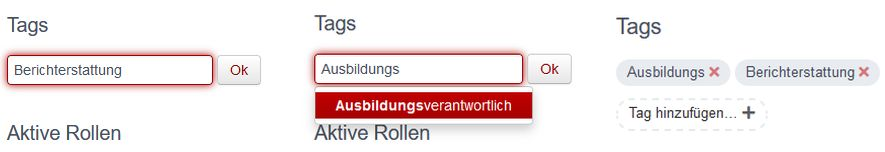

Ajouter de nouveaux tags non structurés (droite: Sélectionner un tag créé précédemment)

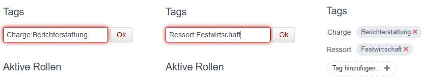

Ajouter de nouveaux tags structurés (séparation des deux termes par deux points)

#### Saisir les responsables (président, directeur, etc.)

Il est important que les responsables de la société soient saisis ou identifiés en tant que tels dans le système. Vous vous assurez ainsi que vos responsables reçoivent également les messages correspondants de votre association cantonale et de l’Association suisse des musiques. Afin d’éviter les e-mails et courriers inutiles, l’ASM et ses associations cantonales essaient d’envoyer leurs informations de manière ciblée: les invitations aux conférences destinées aux directrices et directeurs ne sont envoyées qu’à ces derniers; les informations en rapport avec le COVID-19, par exemple, comme les indications sur l’indemnité de chômage partiel concernent les président(e)s de société, etc.

(Saisir_le_directeur)=

##### Saisir le/la directeur(trice)

Lors de la saisie des directeur(trice)s, il convient de distinguer s’ils (elles) sont eux-mêmes (elles-mêmes) membres de la société concernée ou non.

```{important}
Pour les membres, les cotisations annuelles correspondantes (ASM, SUISA et associations cantonales) doivent être payées et les années d’activité des membres comptent pour le calcul des distinctions de vétérans. Pour les non-membres, les cotisations annuelles sont supprimées et, par conséquent, les années d’activité également.
```

Les directeur(trice)s doivent **dans chaque cas** se voir attribuer le rôle  `[Société de musique XY] → Directeur(trice`:

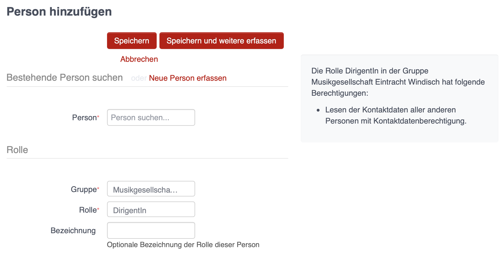

Si un(e) directeur(trice) est également membre de la société correspondante, il faut **en plus** lui attribuer le rôle `Membres → Membre`:

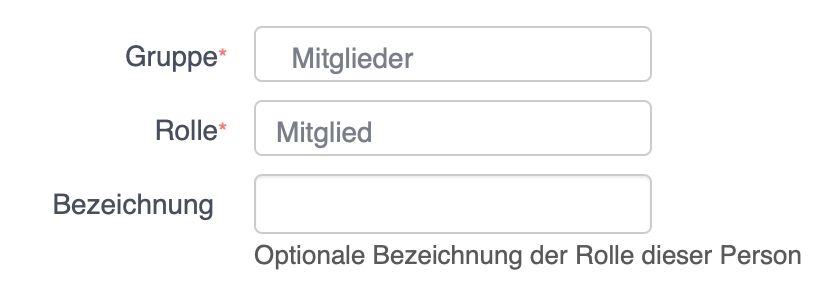

##### Saisir le président

Outre le rôle `Membres → Membre` (si le président est lui-même aussi membre actif), il faut lui attribuer également le rôle `Comité → Président`.

```{admonition}
La procédure pour la saisie du vice-président, du caissier, du responsable des vétérans, du président de la commission de musique, etc. est analogue à celle du président de la société.
```

#### Gérer les vétérans

##### Vérification des inscriptions selon le livret de sociétaire

Pour que le calcul des années d’activité d’un(e) musicien(ne) puisse se faire correctement, ses affiliations actuelles et passées aux sociétés de l’association doivent être saisies dans hitobito. Pour le vérifier, affichez le membre en question en tapant son nom dans le grand champ de recherche en haut de la page. Une recherche est déjà effectuée après la saisie de trois caractères, de sorte qu’il n’est pas nécessaire de saisir le nom en entier.

Dans la vue d’ensemble de la personne, vous voyez toutes les données relatives à cette dernière, notamment, dans la section «Autres informations», le nombre d’«années actives actuelles» (dans l’exemple ci-après: 21 ans): [anonymiser la capture d’écran]

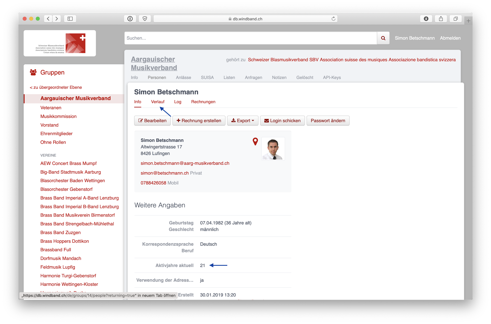

Les affiliations actuelles et passées dans les sociétés de l’association peuvent être affichées sous la vue «Historique». Là, nous nous intéressons aux entrées avec le rôle «Membre» dans un groupe «[Société de musique XY] / Membres».

Si toutes les affiliations de la personne ne sont pas encore saisies, celles manquantes peuvent être (re)saisies via la commande «Nouveau rôle». Pour ce faire , le rôle `[Société de musique XY] → Administrateur` ou `Membres → Gestion des adresses` est nécessaire:

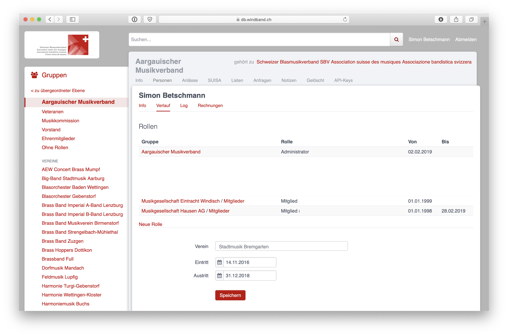

```{admonition}
Si une affiliation est déjà terminée au moment de la saisie (ultérieure), c’est-à-dire que la personne n’est plus membre de cette société, l’inscription doit impérativement être faite ici. Le bouton `Ajouter un rôle` dans la vue «Info» ne peut pas être utilisé à cet effet, car il n’est pas possible d’y indiquer une date de fin. Le bouton `Ajouter un rôle` dans la vue «Info» ne convient que pour l’attribution de rôles que la personne exerce actuellement.


```

```{admonition}
Pour le calcul des **années d’activité**, seul le rôle `Membres → membre` compte. Les rôles `Membres → Membre d’honneur`, `Membres → Gestion des adresses` et `Membres → Membre passif` ne génèrent pas d’années d’activité et n’ont donc pas d’incidence financière, c’est-à-dire que pour les personnes ayant (uniquement) ces rôles, aucune cotisation ne doit être payée. Si un membre actif est nommé membre d’honneur, ce rôle doit donc être attribué en plus (il ne faut donc pas remplacer le rôle `Membres → Membre` par le rôle `Membres → Membre d’honneur`), afin que le membre continue à accumuler des années d’activité et que les cotisations de membre soient facturées pour lui.
```

Une fois tous les engagements du membre saisis, ses années d’activité, déterminantes pour le calcul des distinctions cantonales et fédérales, peuvent être consultées dans la vue d’ensemble de la personne. Cette indication apparaît d’ailleurs également sur les listes de membres de la société (en ligne ainsi que dans les listes exportées).

##### Etablir une liste de vétérans

Si une société souhaite savoir lesquels de ses membres peuvent être nommés vétérans cantonaux pour l’année en cours (25 ans d’activité), sa liste de membres peut être filtrée en conséquence. Pour ce faire, il faut accéder à la société et ouvrir le menu «Personnes». Sous «Autres vues», il est possible de créer un nouveau filtre: actuellement, les années d’activité sont exactement de 25

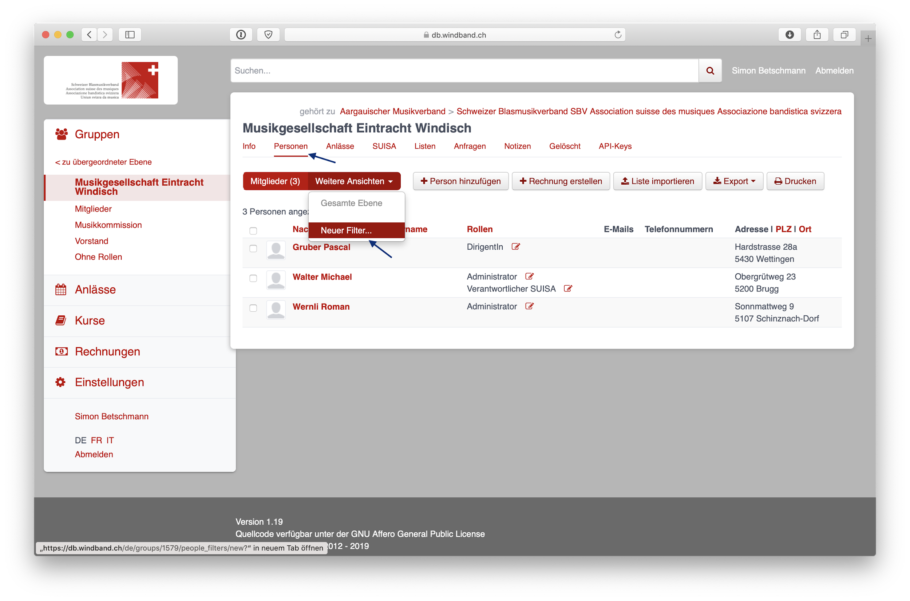

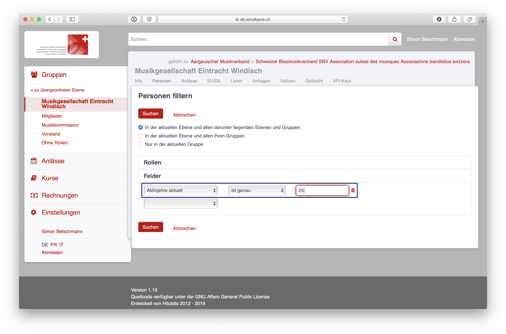

La liste créée au moyen d’un tel filtre peut alors être soit imprimée (PDF), soit téléchargée et traitée électroniquement (CSV, Excel, vCard, étiquettes,...).

### Menu Evénements

#### Création d’un événement

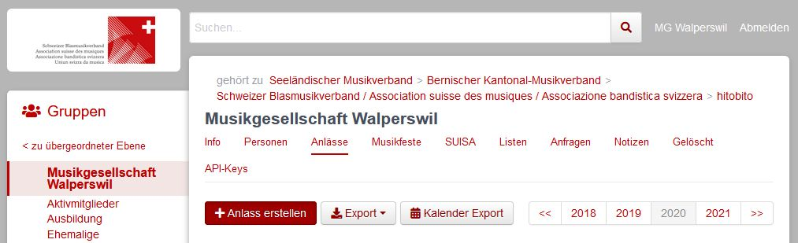

Un administrateur et le président peuvent créer des événements pour la société. Un gestionnaire d’adresses peut le faire pour «son» groupe.

```{admonition}
Séparer les réponses prédéfinies par des virgules pour permettre à l’utilisateur de faire un choix (p. ex. «Taille de t-shirt: s,m,l,xl»)
```

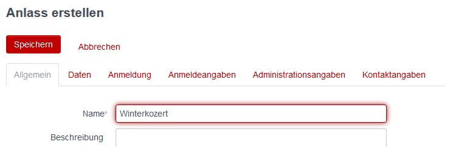

L’onglet **Généralités** doit contenir au moins le nom de l’événement.

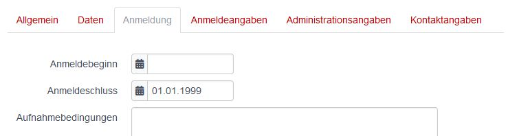

L'onglet **Inscription** permet de définir qui peut s’inscrire à l’événement et comment. Si aucune inscription n’est possible, une date déjà passée est utilisée comme date limite d’inscription.

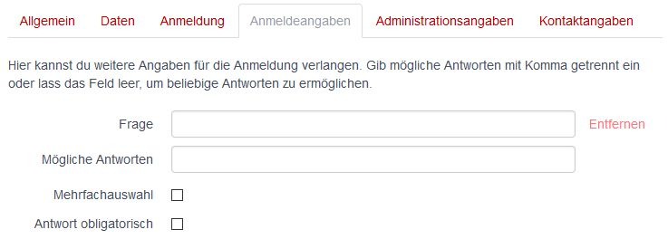

Dans l'onglet **Données d'inscription**, il est possible de définir des questions auxquelles il faut répondre lors de l’inscription. Si des réponses possibles sont proposées, elles doivent être séparées par une virgule.

Sous **Données administrateur**, il est possible de définir des questions auxquelles il faut répondre lors de l’inscription et dont les réponses ne peuvent être consultées que par l’administration du cours.

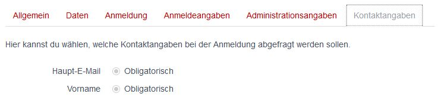

L'onglet **Coordonnées** permet de déterminer quelles données de membre sont envoyées ou requises pour l’inscription. Si certaines données obligatoires pour l’inscription ne sont pas renseignées par l’utilisateur, l’inscription n’est pas possible et l’utilisateur doit d’abord remplir ces données dans son profil.

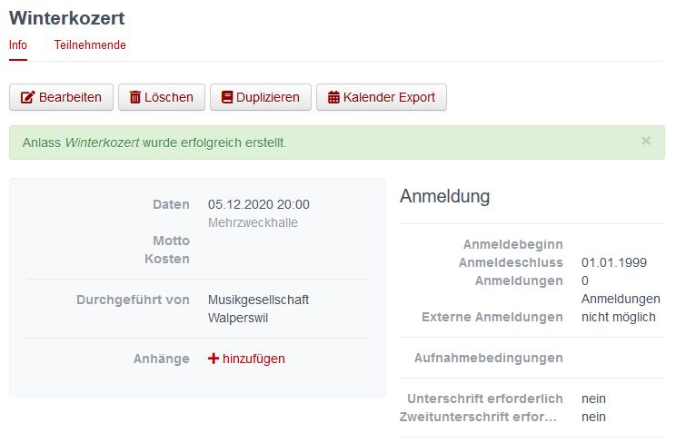

Après l’enregistrement, l’événement créé s’affiche. Il est ici possible de proposer le téléchargement d’un programme de concert ou d’autres documents via **Annexes +ajouter**. Les erreurs peuvent être corrigées en cliquant sur le bouton Traiter. L’événement créé peut bien sûr être supprimé, dupliqué pour un autre événement ou exporté sous forme d’entrée de calendrier.

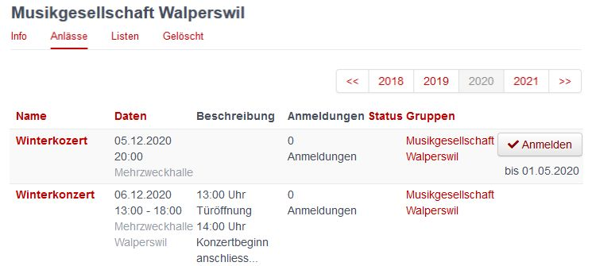

Présentation des événements avec et sans possibilité d’inscription

### Menu SUISA

#### Déclarations à SUISA

Au 31 décembre de chaque année, les sociétés doivent déclarer à SUISA les œuvres qui ont été jouées au cours de l’année écoulée. SUISA peut ainsi verser aux artistes concernés un montant correspondant à la fréquence d’exécution de leurs œuvres.

##### Voir les prestations enregistrées

Les personnes ayant le rôle «Responsable SUISA» peuvent afficher dans le module Groupes, sous le point de menu «SUISA», les prestations enregistrées jusqu’à présent pour leur société et les exporter si nécessaire (CSV, Excel). Les entrées sont séparées par l’année de prestation (dans l’exemple «2019») et classées par prestation:

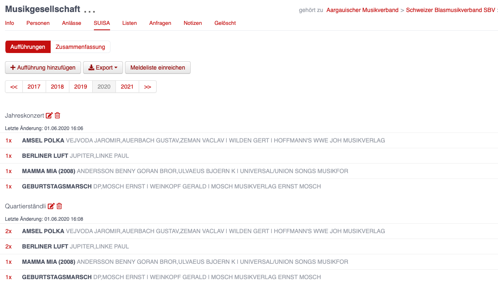

```{admonition}
Dans hitobito, le rôle d’administrateur n’est pas gage d’accès à toutes les fonctions. Même les administrateurs ne voient pas certaines fonctions dans hitobito, comme par exemple le point de menu «SUISA».
Les administrateurs qui souhaitent soutenir leurs responsables SUISA doivent donc également s’attribuer le rôle «Responsable SUISA».

```

##### Statut de la liste des déclarations

Cette page permet également de voir si la liste SUISA a déjà été déposée ou si elle doit encore l’être. Le bouton peut présenter les statuts suivants:


La liste a déjà été déposée et ne peut pas l’être à nouveau.


La liste est complétée, mais n’a pas encore été déposée.


La liste est vide et ne peut pas être déposée. Prière de saisir d’abord vos œuvres.

##### Saisir une nouvelle exécution

Pour saisir une nouvelle exécution, cliquez sur le bouton «Ajouter une exécution». Dans le dialogue «Saisie SUISA», les œuvres de l’année dernière que vous avez listées apparaissent dans une liste, ainsi qu’un champ de recherche «Rechercher une œuvre...».

Pour les œuvres déjà exécutées, le nombre de prestations peut être inscrit directement ou indiqué à l’aide des touches à flèche:

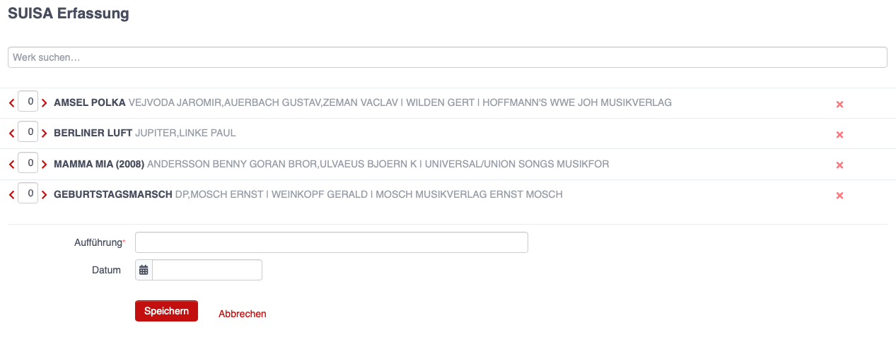

Les champs «Exécution» et «Date» à la fin de la liste désignent plus précisément l’événement et sont tous deux facultatifs.

Les œuvres non mentionnées peuvent être recherchées via le champ de recherche:

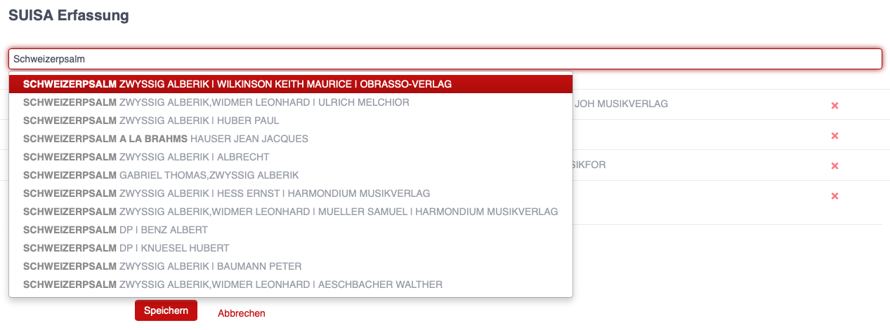

Tant que la liste n’a pas été déposée (cf. [Déposer la liste](Meldeliste_einreichen)), vous pouvez saisir et traiter de nouvelles exécutions aussi souvent que vous le souhaitez.

##### Créer une nouvelle œuvre

Si une œuvre n’est pas encore saisie dans la banque de données de SUISA, la recherche n’aboutira à aucune occurrence. La commande «Créer une œuvre» apparaîtra à la place:

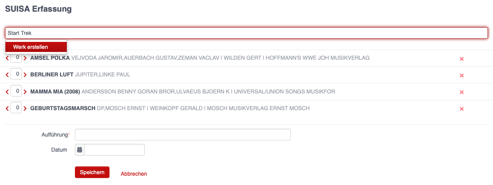

Pour créer une œuvre, il faut au moins en saisir le titre et le compositeur. La mention de l’arrangeur et de l’éditeur est facultative:

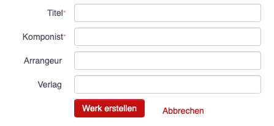

(Déposer_une_liste)=

##### Déposer la liste

Une fois toutes les œuvres saisies, la liste doit être déposée. Pour ce faire, cliquez sur le bouton «Déposer la liste». En guise de confirmation, vous recevrez le message «Liste déposée» et le bouton sera alors désactivé et renommé «Liste déposée»:

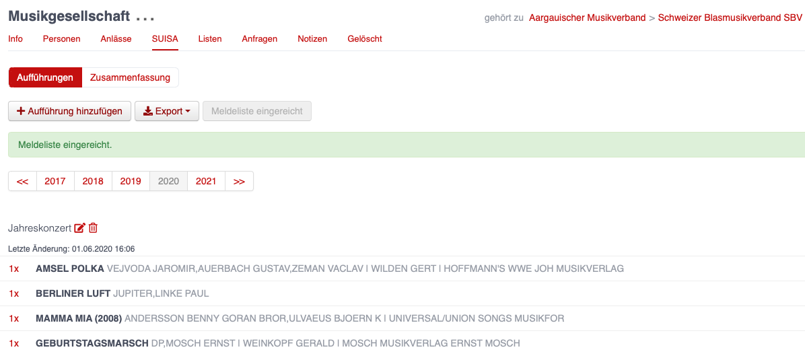

##### Déposer une liste sans saisir d’œuvre

Les sociétés peuvent également déposer leur liste sans saisir d’œuvre. A cet effet, les options suivantes sont disponibles:

- Association d’ensembles<br> Les sociétés qui se sont associées n’annoncent leurs œuvres qu’une seule fois, à savoir qu’une des sociétés de l’association dépose la liste comme d’habitude et les autres sociétés impliquées choisissent l’option «association d’ensembles».

- Sans exécution musicale cette année<br> Les sociétés qui, en raison d’un effectif insuffisant ou de circonstances extérieures (p. ex. une pandémie), n’ont pas donné de prestations au cours d’une année, choisissent cette option.

- Décompte SUISA via des tiers <br> Certaines sociétés membres (p. ex. des écoles de musique) ont déjà des contrats avec SUISA. Elles ne sont pas tenues de déclarer leurs prestations via hitobito.

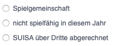

### Menu Listes

Sont ici affichées toutes les listes créées par le groupe actuellement sélectionné. Il s’agit de listes de personnes filtrées avec des fonctions particulières:

- Une adresse e-mail peut être attribuée à une liste. Un e-mail envoyé à cette adresse est distribué par hitobito à tous les abonnés.
- Les abonnés peuvent être attribués à une liste sur la base de filtres (selon leur rôle, un tag, etc.) ou de manière spécifique, en fonction du nom d’une personne.
- Les listes peuvent être «ouvertes», c’est-à-dire que les personnes intéressées peuvent s’abonner/se désabonner elles-mêmes, ou «fermées», cas dans lequel le créateur de la liste détermine de manière contraignante qui y est abonné.

```{admonition}
Les listes permettent de créer facilement des **listes de publipostage**. Les abonnés gèrent eux-mêmes leurs adresses e-mail, ce qui permet d’envoyer à tout moment des messages à la liste – vous n’avez plus à mettre à jour les adresses e-mail. Si la liste a été créée sur la base d’un filtre (p. ex. tous les présidents de société), les messages envoyés à la liste atteindront toujours les présidents de société actuels au moment du message – il n’est donc pas nécessaire de mettre à jour des listes faites à la main.
```

#### Créer une liste

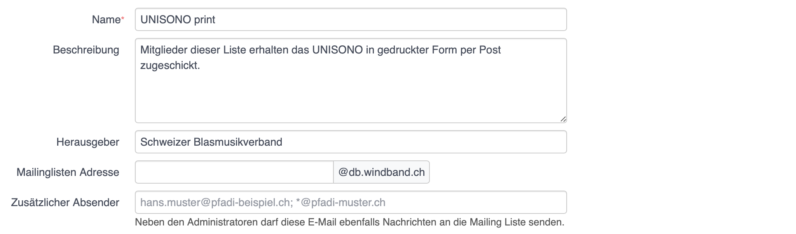

Outre un nom de liste (champ obligatoire), il est également possible de définir une description, l’éditeur, une adresse de liste de publipostage (adresse e-mail à laquelle les messages peuvent être envoyés pour être distribués aux abonnés) et des expéditeurs supplémentaires. Si aucun expéditeur supplémentaire n’est indiqué (et si l’option «N’importe quel expéditeur peut écrire sur la liste de publipostage» n’est pas activée), seuls les administrateurs peuvent envoyer des messages à la liste. Si d’autres personnes doivent être autorisées à envoyer des messages à la liste, elles peuvent être définies dans le champ «Expéditeurs supplémentaires». Outre les adresses électroniques explicites (p. ex.[info@windband.ch](mailto:info@windband.ch)) ), il est également possible d’indiquer des domaines entiers  (p. ex. *@windband.ch).

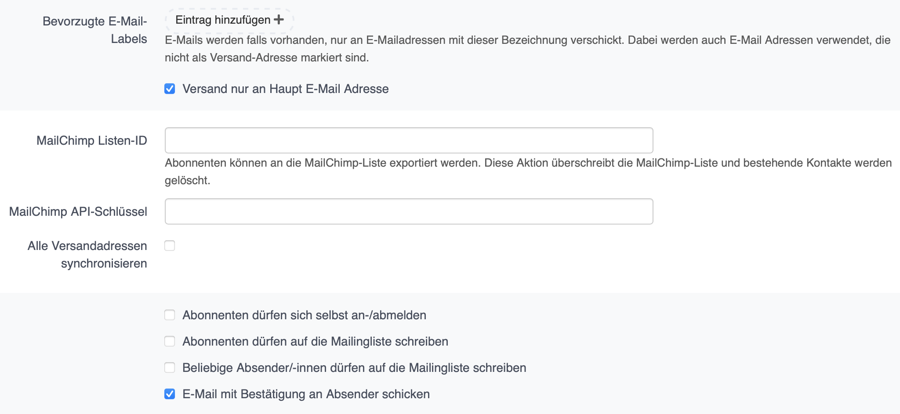

En option, il est possible de faire en sorte que les messages ne soient envoyés qu’à des adresses e-mail avec certains labels ou à des adresses e-mail principales.

De plus, les abonnés peuvent être synchronisés avec une audience MailChimp. Cette action remplace la liste MailChimp et les contacts existants sont supprimés. Les personnes qui se sont désinscrites de cette liste auprès de MailChimp restent désinscrites.

Pour terminer, les options suivantes sont disponibles:

- Les abonnés peuvent s’inscrire/se désinscrire eux-mêmes
- Les abonnés peuvent écrire sur la liste de publipostage
- Les abonnés peuvent écrire sur la liste de publipostage
- Il est possible d’envoyer un e-mail de confirmation à l’expéditeur

Si l’option «Les abonnés peuvent s’inscrire/se désinscrire eux-mêmes» est activée, la liste apparaît chez les personnes dans la vue «Abonnements», sous «Abonnements disponibles».

## Module Factures

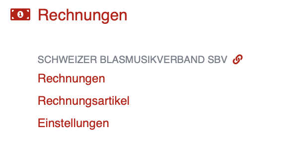

Dans le module Factures se trouvent les paramètres des factures, les différents articles de facturation ainsi que les factures créées.

#### Factures

Vous trouverez ici un aperçu de toutes les factures créées et vous pourrez les modifier, les supprimer ou les imprimer. Les paiements peuvent également être importés ici au moyen d’un fichier XML camt.054[^2].

A cet endroit, il est également possible de créer des factures **externes**, c’est-à-dire dont les destinataires ne sont pas saisis dans hitobito.

```{tip}
Les factures pour des destinataires au sein de hitobito sont créées à partir de listes de personnes, d’une liste de participants (cours ou événements) ou d’une personne individuelle et ne peuvent pas être créées dans le module Factures (voir [Etablir une facture](Etablir_une_facture)).
```

#### Articles de facturation

Les postes de facturation fréquemment utilisés (p. ex. cotisation de membre) peuvent être prédéfinis ici. Ces articles peuvent être sélectionnés et personnalisés lors de l’établissement des factures.

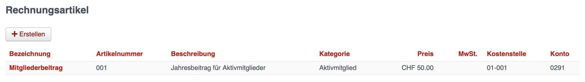

Module Factures → Articles de facturation

#### Paramètres

Dans les paramètres de la facture, il est possible de saisir des informations générales telles que l’adresse de l’expéditeur, l’e-mail de l’expéditeur, les jours jusqu’à l’échéance, le numéro de TVA, etc. Il est également possible d’y définir les textes pour le premier, le deuxième et le troisième rappel.

Ces paramètres sont propres à l’association ou à la société et peuvent être définis individuellement pour chaque groupe.

Pour l’intégration et le contrôle directs des paiements dans hitobito, des interfaces avec les établissements financiers suivants sont disponibles depuis janvier 2022:

- Postfinance
- Credit Suisse
- Raiffeisen Suisse
- UBS
- Banque cantonale de Lucerne
- Banque cantonale de St-Gall
- Banque cantonale de Thurgovie
- Banque cantonale de Zurich
- Valiant
- BancoStato
- BEKB | BCBE
- Banque cantonale de Zoug

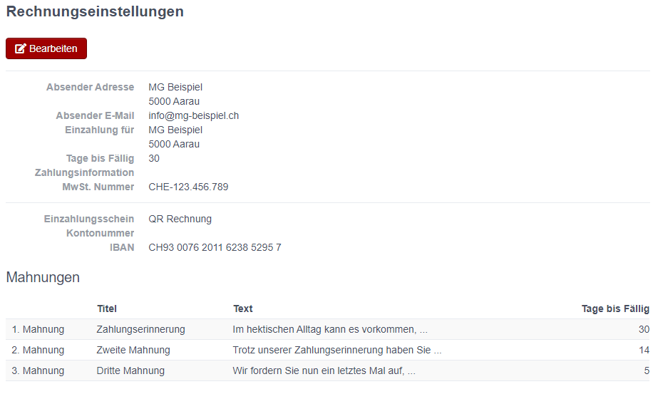

(Etablir_une_facture)=

#### Etablir une facture

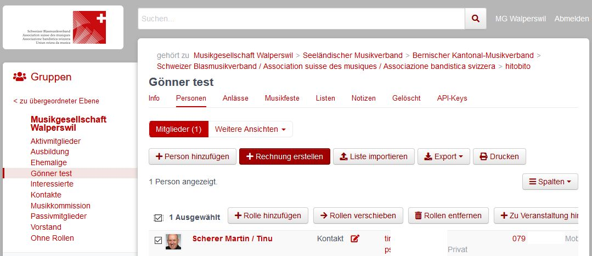

La facture proprement dite est créée en sélectionnant le groupe. En cochant le champ de sélection, il est également possible d’établir des factures pour des membres individuels.

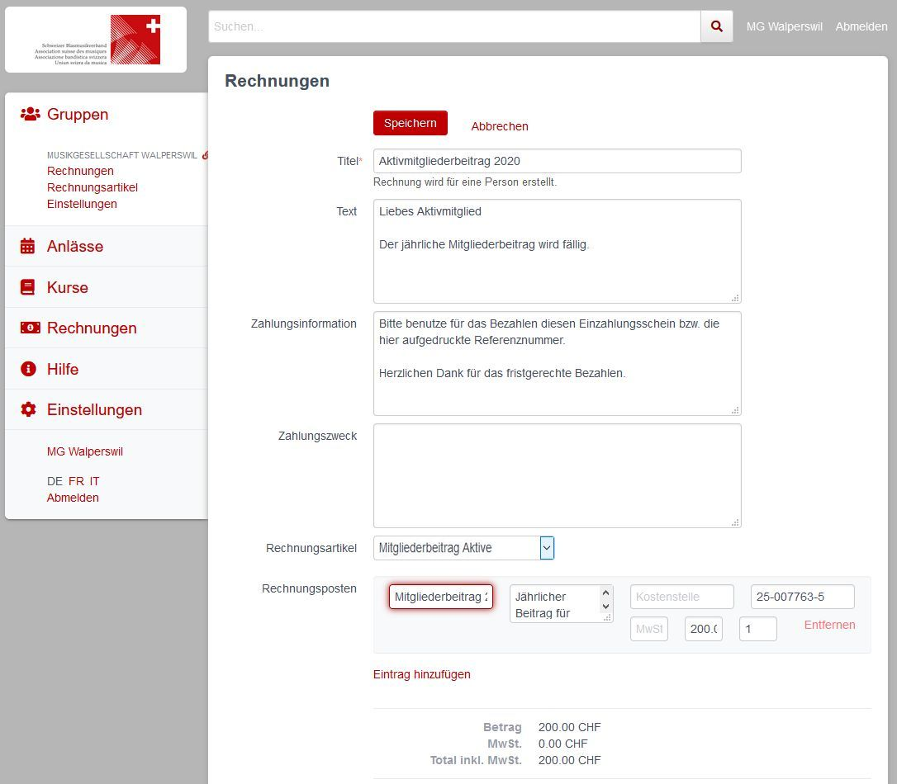

Un intitulé clair de la facture aide lors du contrôle.

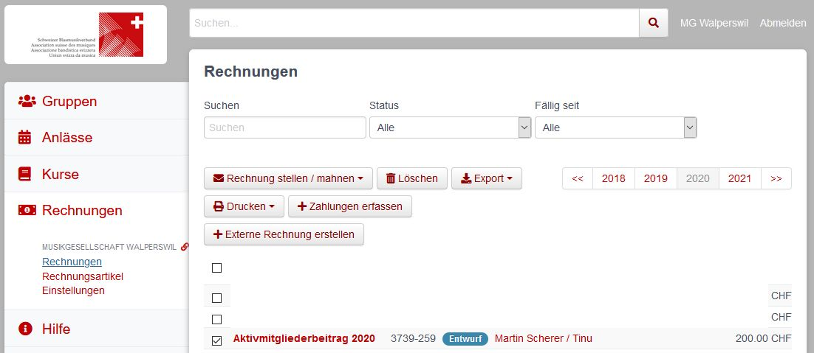

La facture établie peut maintenant être consultée sous forme de projet dans le menu Factures, éditée, assortie de délais, imprimée ou envoyée directement par e-mail via le bouton Facturer / Relancer.

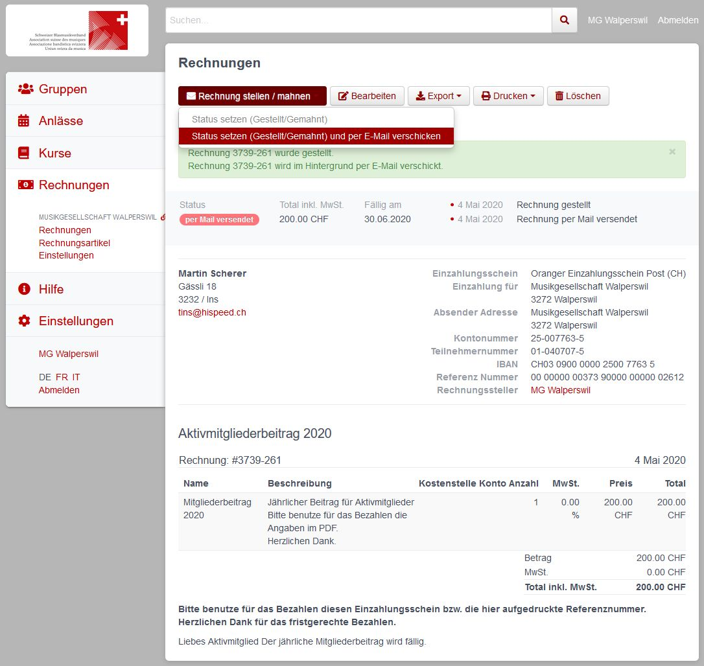

L’e-mail reçu:

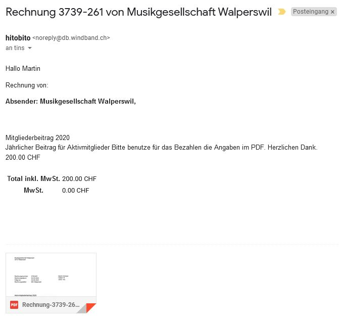

... et la facture au format PDF:

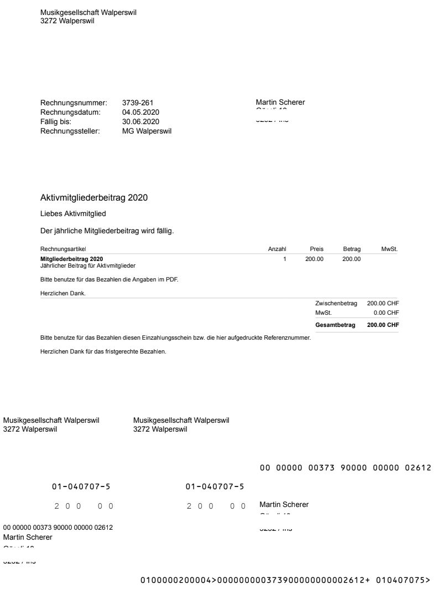

#### Vérifier et gérer les factures

Le menu Factures permet de gérer les débiteurs.

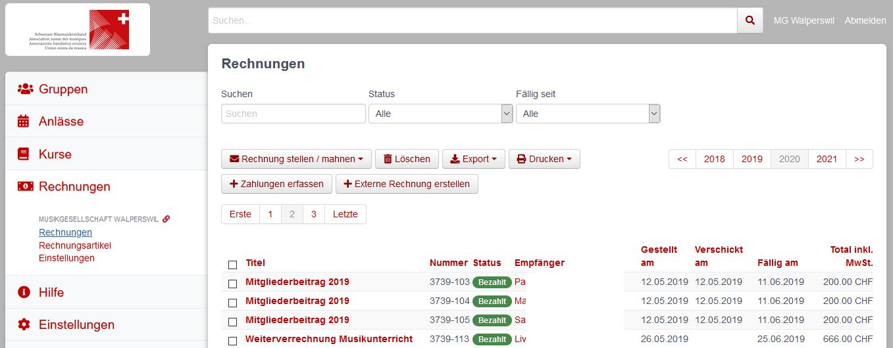

Le bouton Saisir le paiement permet de télécharger un fichier XML camt.054 et de l’attribuer automatiquement aux factures.

Pour marquer manuellement une facture comme payée, il faut ouvrir la facture et saisir le paiement reçu (montant et date de réception) avec la commande «+ Créer paiement»:

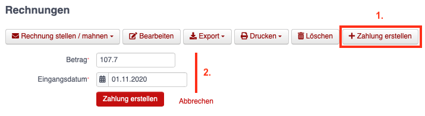

## Module Evénements

##### Vue d’ensemble

Dans le module Evénements, vous trouverez un aperçu des événements organisés par les groupes dont vous êtes membre, ainsi que leurs groupes supérieurs. D’autres événements figurent sous le groupe organisateur:

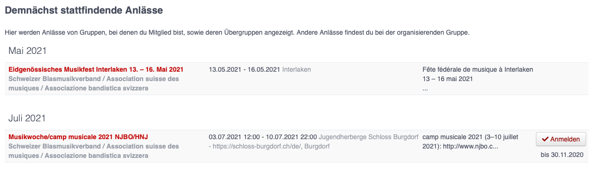

Vous pouvez ici vous inscrire directement à ces événements, pour autant que l’inscription soit déjà validée ou que la date limite d’inscription ne soit pas encore passée.

##### Création d’un événement

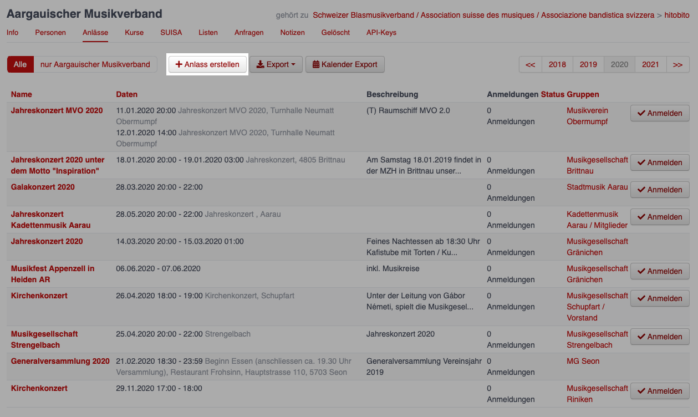

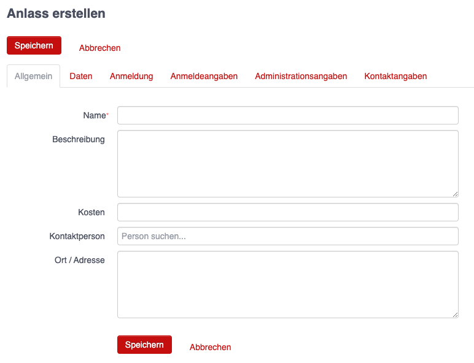

Notes de bas de page:

[^1]: Technique: les personnes autorisées à saisir et à consulter les tags sont celles qui ont des droits d’écriture sur la personne. Les rôles selon [https://github.com/hitobito/hitobito_sbv/](https://github.com/hitobito/hitobito_sbv/) mit *_full [^2]: avec *_full [^2]: un fichier XML camt.054 est la résolution d’écritures collectives et l’avis de débit et de crédit. Celle-ci contient une série de positions comptables différentes qui sont attribuées automatiquement aux factures existantes sur la base du numéro du BVR.


